<p align="center">
  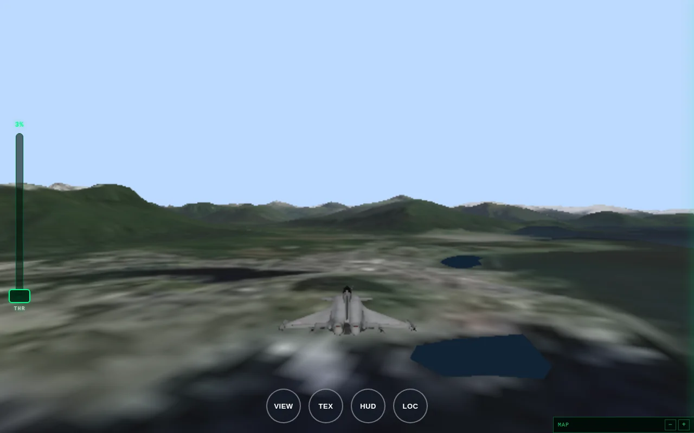
</p>

<h1 align="center">Sitka Skies — OpenSkyFlight</h1>

<p align="center">
  A browser flight simulator over <b>real-world terrain</b>, home-based in Sitka, Alaska.<br>
  No install. No API key. No build step. Works on iPad, phone, and desktop.
</p>

<p align="center">
  <a href="https://luciddreamer-ai.github.io/OpenSkyFlight/"><b>▶ Play in your browser</b></a>
  &nbsp;·&nbsp;
  <a href="#install">Install as an app</a>
  &nbsp;·&nbsp;
  <a href="#games">Mini-games</a>
</p>

---

## What it is

Real terrain streamed from live elevation and imagery data, with a flight model on
top. Spawn on the ramp at **Sitka Rocky Gutierrez Airport (PANT)** and climb out
over Sitka Sound toward Kruzof Island and Mount Edgecumbe — or jump anywhere on
Earth and land on the real thing.

The renderer is [three.js](https://threejs.org) with the WebGPU backend and an
automatic WebGL 2 fallback, so the same build runs on a 2026 laptop and on an iPad
from 2019 without a separate mobile codebase.

## Screenshots

|                                       Sitka Sound                                       |                                   Mount Edgecumbe                                   |                                     Cockpit + HUD                                     |
| :-------------------------------------------------------------------------------------: | :---------------------------------------------------------------------------------: | :-----------------------------------------------------------------------------------: |
| 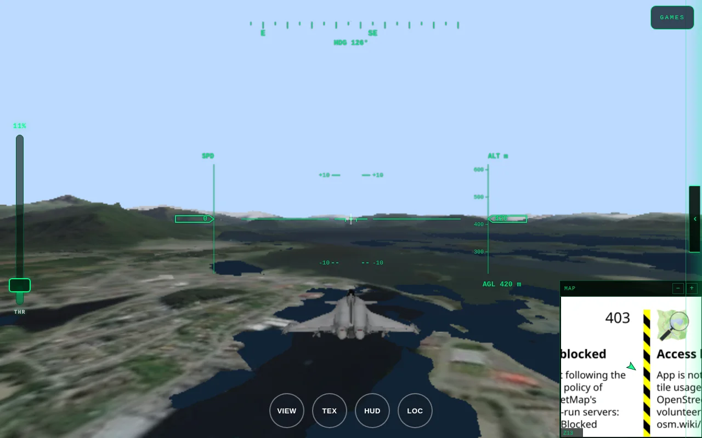 | 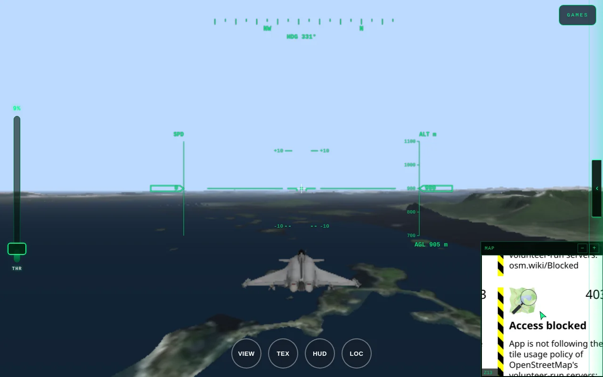 | 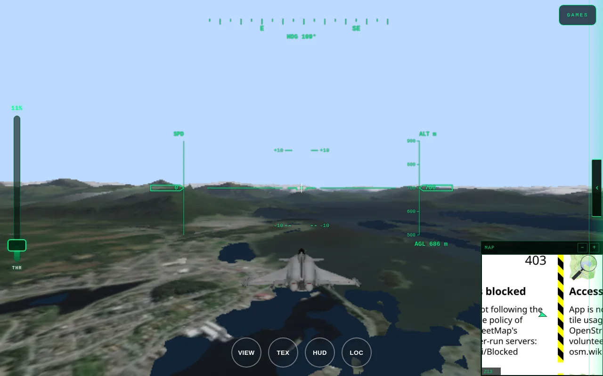 |

## Mini-games

Three playable modes over the same terrain engine, reachable from the **GAMES**
button in the top-right corner. Two more are shown locked rather than hidden, so
the menu doesn't pretend to have more than it does.

|                                                                               |                                                                           |                                                                                   |
| :---------------------------------------------------------------------------: | :-----------------------------------------------------------------------: | :-------------------------------------------------------------------------------: |
| 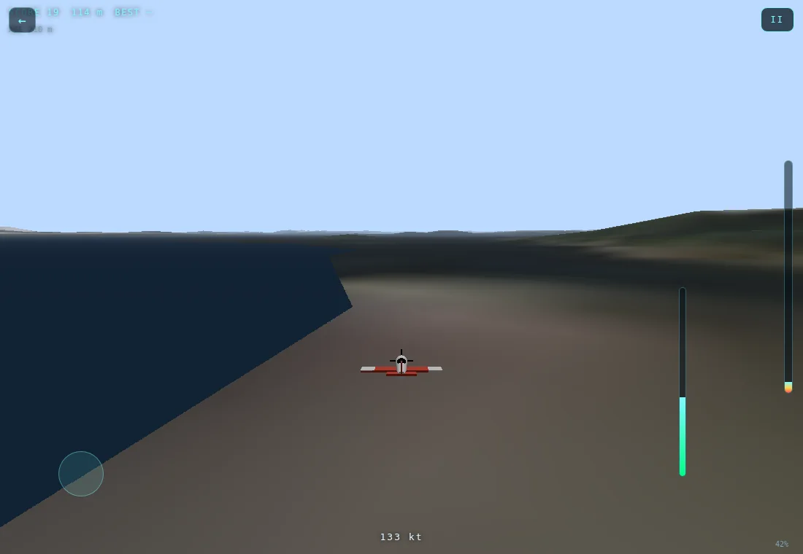 | 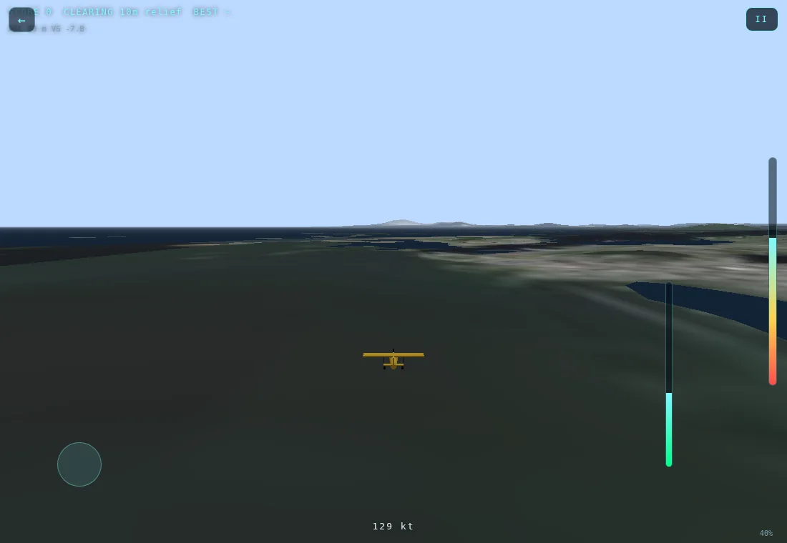 | 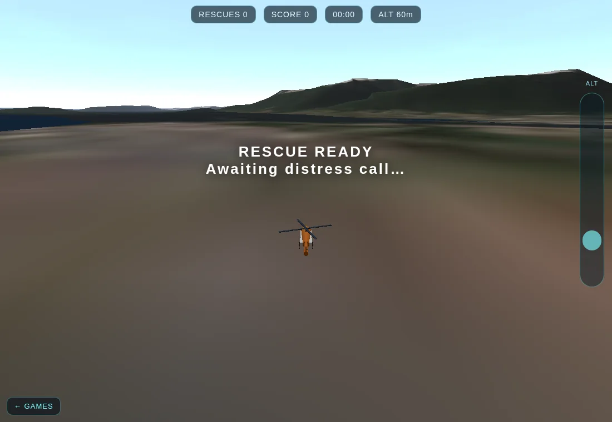 |
|         **Ridge Runner** — proximity flying scored against real rock          |        **Bush Pilot** — find flat ground on the DEM and land on it        |            **Jayhawk Rescue** — hold a steady hover in the rescue ring            |

Each game is a standalone page over the shared terrain, so a bad run in a game
can never corrupt your flight. Adding a game is a folder plus one entry in
[`js/games/games.js`](js/games/games.js) — the launcher is generated from the
catalogue, so there is no per-game branching in the menu.

<p align="center">
  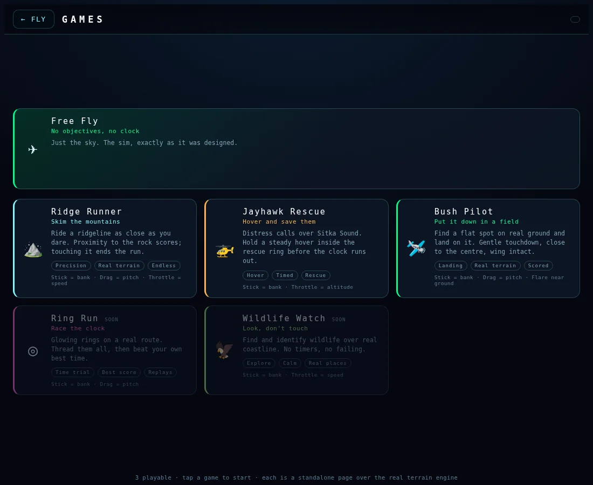
</p>

## Install it

The site is a standard installable web app. No app store, no download.

**iPad / iPhone (Safari)** — Share → **Add to Home Screen**
**Android (Chrome)** — ⋮ → **Install app**
**Desktop (Chrome / Edge)** — install icon in the address bar

Installed, it launches fullscreen with its own icon and no browser chrome, and
long-press (or right-click) the icon for shortcuts to the games and to Mont Blanc.

## On a tablet and phone

The layout is built for touch first: the sim is iPad-native, and every control
meets the 44 pt touch-target minimum on a coarse pointer while staying compact
for a mouse.

|                                  iPad landscape                                   |                                  iPad portrait                                  |                                       iPhone                                        |
| :-------------------------------------------------------------------------------: | :-----------------------------------------------------------------------------: | :---------------------------------------------------------------------------------: |
| 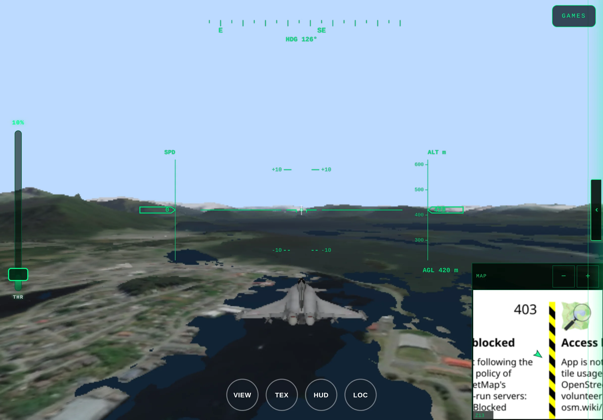 | 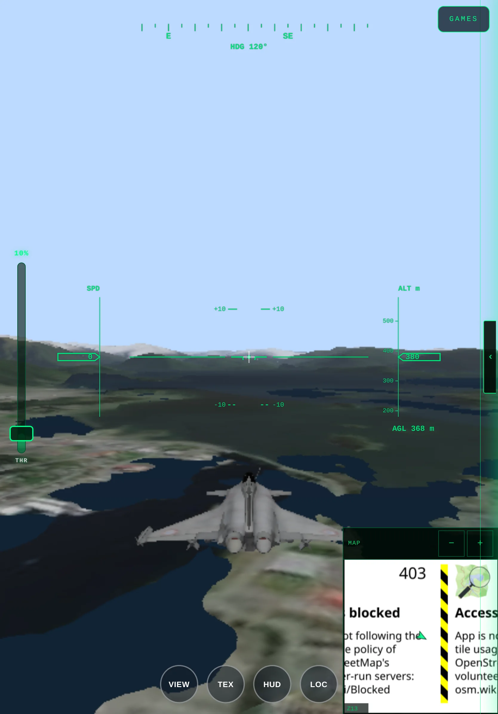 | 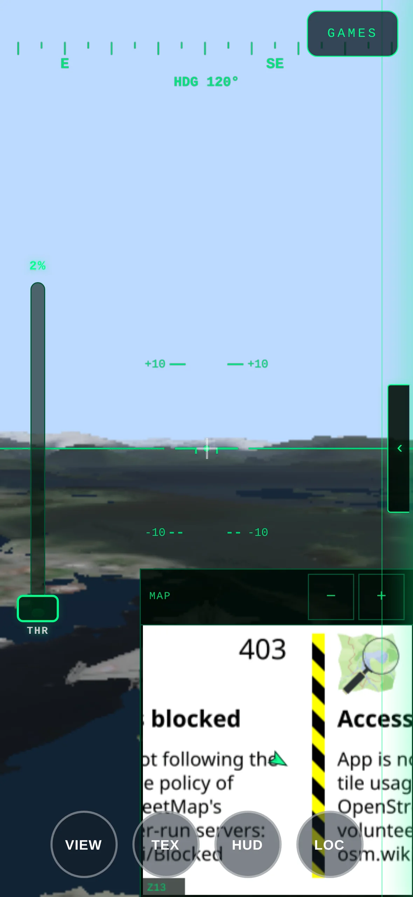 |

Quality is chosen from **measured** capability rather than a device name: the
`CapabilityProbe` reads WebGPU limits, the WebGL renderer string, device pixel
ratio and pointer type, then picks a tier that sets antialiasing, pixel ratio,
terrain LOD and the in-flight tile budget. `Auto` in the control panel can
override it, and `?quality=low|medium|high` forces a tier from a URL.

## Diagnostics

Press **`D`** in the sim or in any game.

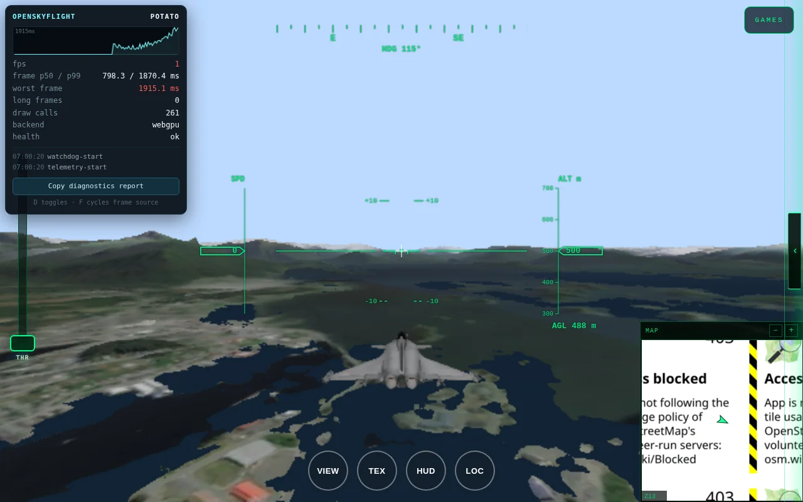

Every capability tier in this project is a guess until it is measured on real
hardware, so the overlay reports what the device is actually doing: FPS against a
60 fps reference, p50/p95/p99 frame times, the single worst frame, draw calls,
the detected tier and backend, and a rolling event log.

The **Copy diagnostics report** button puts a full JSON dump on your clipboard —
device, frame statistics and events. It is the entire delivery mechanism:
**nothing is uploaded, ever**. Paste it into an issue and you have handed over
exactly what a fix needs.

It also watches for failure rather than waiting for one:

- **stall** — the render loop stopped being called at all
- **long frame** — a GPU-watchdog (TDR) precursor
- **device / context loss** — correlated with the frame data in one timeline
- **NaN flight state** — silent; it propagates into the camera matrix and renders
  a broken scene with a clean console

A stall or a NaN raises a visible notice in the app, because a detector that
only writes to a console nobody opens has never actually fixed anything.

## Controls

**Touch** — left stick to steer (push forward for more speed, pull back to slow),
left slider for throttle, drag the right side to look around, and the
`VIEW` / `TEX` / `HUD` / `LOC` buttons for camera, texture mode, instruments and
the location picker.

**Keyboard**

| Key               | Action                                | Key         | Action                                           |
| :---------------- | :------------------------------------ | :---------- | :----------------------------------------------- |
| `W` `S` / `↑` `↓` | pitch down / up                       | `V`         | chase ⇄ cockpit camera                           |
| `A` `D` / `←` `→` | roll / yaw                            | `T`         | texture mode (satellite / OSM / SAR / elevation) |
| `E` / `Q`         | climb / descend                       | `H` · `M`   | toggle HUD · minimap                             |
| `Enter`           | dismiss the splash and fly            | `L`         | location picker (search + presets)               |
| `P` / `N`         | record a flight-plan waypoint / clear | `1`–`9`     | jump to a saved waypoint                         |
| `D`               | diagnostics overlay                   | `I`         | frame-timing stats                               |
| `R`               | high-res terrain                      | `X`         | terrain wireframe debug                          |
| `B`               | bomb                                  | `B` `Shift` | run the flight benchmark                         |

`Esc` closes whatever panel is open.

## Aircraft

Nine flyable, selected from the hangar on the splash screen or with `?plane=`:

`rafale` · `cub` · `otter` · `atr` · `biplane` · `beaver` · `extra` · `jayhawk` · `b17`

The Rafale is a real glTF with chase and cockpit cameras; the rest are procedural
models built at runtime.

## URL parameters

| Parameter                    | Effect                                                             |
| :--------------------------- | :----------------------------------------------------------------- |
| `?lat=…&lon=…`               | start somewhere else on Earth                                      |
| `?plane=rafale`              | pick an aircraft                                                   |
| `?quality=low\|medium\|high` | force a graphics tier instead of Auto                              |
| `?debug=1`                   | expose `window.__osf` (flight controller, terrain, config)         |
| `?tiles=proxy`               | use the local dev server's tile cache instead of fetching upstream |

## Run it locally

No build step. The only requirement is a static server, because the app is
native ES modules and will not load over `file://`.

```bash
git clone https://github.com/Luciddreamer-ai/OpenSkyFlight.git
cd OpenSkyFlight
npm install          # dev tooling only — eslint, prettier. The app has no runtime deps.
npm run dev          # http://localhost:3000
```

To use the local tile cache (faster repeat runs, and it works when the upstream
tile servers are unreachable), open `http://localhost:3000/?tiles=proxy`.

## How it's put together

```
index.html            the simulator
games/                launcher + one folder per mini-game
js/
  app.js              boot sequence and the frame loop
  diagnostics/        telemetry, engine watchdog, the D-key overlay
  terrain/            three-tile wiring, DEM sampling, tile pressure
  atmosphere/         sky and sun position
  input/              keyboard dispatch, touch controls, HUD hit-testing
  games/              shared game runtime and the game catalogue
vendor/               vendored three-tile fork
scripts/              dev server, CI gates
```

There is no build step and no bundler. The import map in each page points `three`
at a pinned CDN build and `three-tile` at a vendored fork, which is why the
repository can be served by GitHub Pages unchanged.

**Both of those dependencies are invisible to `package.json`.** `scripts/check-runtime-deps.mjs`
runs in CI to make sure the four pages still agree on the pinned version and that
every path they reference actually exists on disk — a class of bug that shows up
in production as a blank canvas and a loading screen that never goes away.

## Development

```bash
npm run ci    # lint, format check, import graph, diagnostics assertions, dep consistency
```

`npm run ci` is the whole gate, and each part executes something rather than
merely asserting it. `scripts/check-diagnostics.mjs` drives the watchdog and
fails if it stops detecting a stall, a long frame or a NaN.

## Credits

- **Original engine** — [Jean Jérôme / OpenSkyFlight](https://github.com/jeanjerome/OpenSkyFlight).
  The terrain engine, WebGPU renderer and flight model are theirs; this fork is
  the touch-control, games and diagnostics work on top.
- **Terrain** — [AWS Terrarium](https://registry.opendata.aws/terrain-tiles/)
  elevation, Esri World Imagery, [OpenStreetMap](https://www.openstreetmap.org/copyright)
  base tiles.
- **Rendering** — [three.js](https://threejs.org), [three-tile](https://github.com/ventolab/three-tile).

## Licence and attribution

**The code has no licence file, which is a real gap rather than a permissive
default.** Neither this repository nor the [upstream project](https://github.com/jeanjerome/OpenSkyFlight)
declares one, so there is currently no granted right to use, copy or modify the
code. That needs fixing before anyone builds on this, and it is a decision for
the maintainer rather than something to guess at in a README.

The data has its own terms and they do apply today:

| Source                                                        | Used for          | Terms                      |
| :------------------------------------------------------------ | :---------------- | :------------------------- |
| [AWS Terrarium](https://registry.opendata.aws/terrain-tiles/) | elevation / DEM   | public domain              |
| [OpenStreetMap](https://www.openstreetmap.org/copyright)      | base map tiles    | ODbL, attribution required |
| Esri World Imagery                                            | satellite basemap | attribution required       |

If you fork this, keep the original engine's credit intact — the terrain engine,
WebGPU renderer and flight model come from Jean Jérôme's project.
